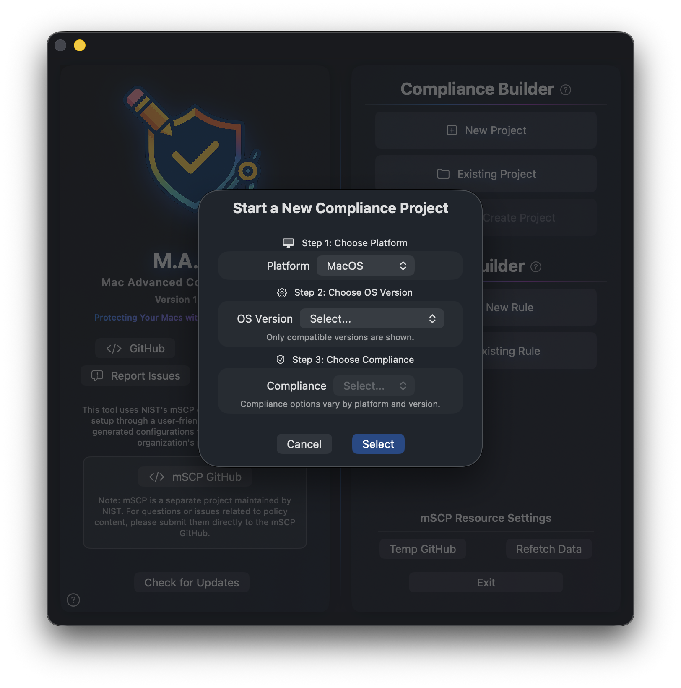
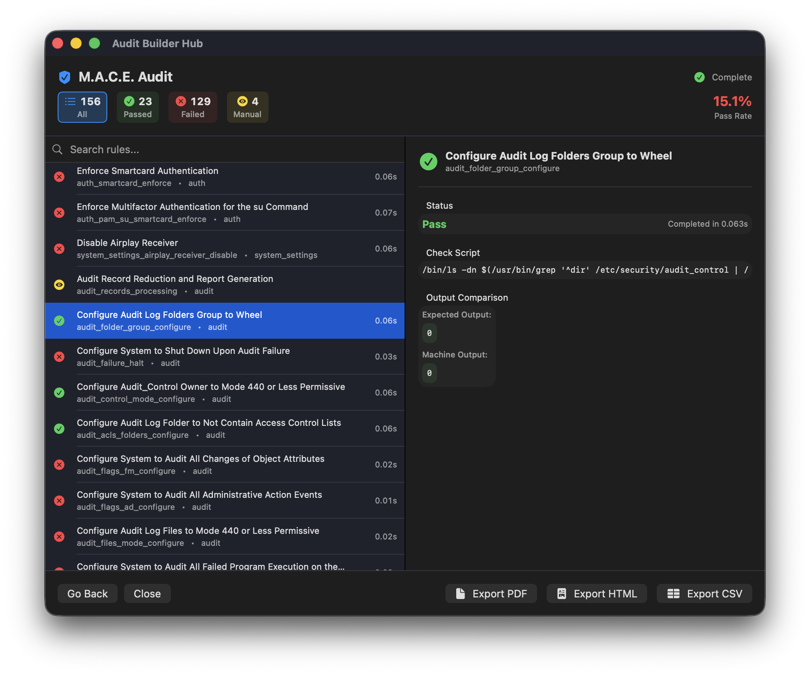

  

<h1 align="center">M.A.C.E. — Mac Advanced Compliance Editor</h1>

<strong>The future home of a modern macOS compliance app powered by NIST's mSCP 2.0</strong>

  <!-- Badges -->
  
  
  
  

## Contents
- [📖 About](#about)
- [🚦 Status](#status)
- [🖼️ Screenshots](#screenshots)
- [✨ Features](#features)
- [🔮 Upcoming](#upcoming-features)
- [🙌 Credits](#credits)

## About
M.A.C.E. (Mac Advanced Compliance Editor) is a modern macOS app to simplify compliance baseline creation, documentation, auditing, and management using [NIST's mSCP 2.0](https://pages.nist.gov/macos_security/). The goal of this project is to help Mac admins make compliance easy and seamless, while providing customization and encouraging feedback. M.A.C.E. aims to evolve based on the needs of the community, adding features and functions that make compliance management better for everyone. Designed for Mac admins, it focuses on visual rule editing, flexible baselines, and streamlined audits.

## Status
🚧 **Active development. Screenshots and features may change as  evolves.**

> ⚠️ **Alpha Release Notice**  
> This is an alpha release and does **not** offer all the functions or abilities needed for production use. Many features are blocked or disabled until they are ready. This release is for users to check out the progress so far.  
> Much of this project depends on [mSCP 2.0](https://pages.nist.gov/macos_security/), which has not been released yet. The rules in this app are currently manually combined and uploaded, so they may be stale or inaccurate for now.

**🛠️ Current Focus:**  
- 🗂️ Getting the compliance builder hub to read rules properly and allow user adjustments as simply as possible (assuming mSCP 2.0 format doesn't change)
- 📊 Improving the M.A.C.E. audit engine to provide detailed outputs
- 📝 Working on the M.A.C.E. Documentation engine to provide customizable mSCP-style documentation
- 🏗️ Building an mSCP-style build engine to generate customizable enforcement files like the mSCP format
- 🎨 Providing more customization options for viewing and editing rules

**🚫 Known Limitations:**  
- ❌ Some compliance frameworks and export formats are not yet supported  
- ⏳ mSCP audit and automated rule updates are pending further mSCP 2.0 release
- ⚠️ Rules may not reflect the latest guidance
- 🌐 **Language Support:** Currently, M.A.C.E. only supports American English. While both this project and the mSCP project aim to support additional languages in the future, many core features must be completed first. Community assistance will be needed to expand language support as the project matures.
- 🚫 **No mSCP 1.0 Support:** M.A.C.E. does not focus on supporting mSCP 1.0. This is intentional to encourage users to adopt the new rule style and help advance the mSCP project towards the future.

**💡 Feedback:**  
- 🙅‍♂️ Please avoid reporting bugs at this stage (the app is full of them!)
- 💬 Suggestions for easy-to-add features or "nice to have" ideas are welcome and help guide development

**🔜 Future Plans:**  
- 🧪 Beta releases as mSCP 2.0 matures  
- 📚 Expanded documentation and user guides

## Screenshots
<table>
<tr>
<td align="center">
  
  
<em>Project creation & dashboard</em>

</td>
<td align="center">
  
  
<em>Compliance editor & rule hub</em>

</td>
</tr>
<tr>
<td colspan="2" align="center">
  
  
<em>Audit results & report view</em>

</td>
</tr>
</table>

## Audit Output Examples
You can view sample audit outputs generated by M.A.C.E. in different formats:

- [Audit_Report_Example.pdf](audit_examples/Audit_Report_Example.pdf)
- [Audit_Report_Example.html](audit_examples/Audit_Report_Example.html)
- [Audit_Report_Example.csv](audit_examples/Audit_Report_Example.csv)

## Features
**✨ Current Features**

**🗂️ Project Management**
- Create compliance projects for macOS, iOS/iPadOS, and visionOS
- Open and edit existing projects
- Quick access to recent projects
- Automatic project saving

**📝 Compliance Editor**
- Browse security rules organized by section
- Search and filter by compliance framework (NIST, CIS, DISA STIG, etc.)
- Customize rules to fit your organization's needs
- Enable or disable rules for your baseline

**🔍 Audit System**
- Run compliance checks on your Mac (M.A.C.E. audit)
- View results in real-time (MacOS Only)
- Export reports as HTML, PDF, or CSV
- Add custom branding and device info to reports
- *(mSCP audit support coming when mSCP 2.0 is ready)*

**⬆️ Updates**
- Automatic update notifications
- View release notes for new versions

**🌗 Appearance**
- Light and dark mode support
- Seasonal and holiday app icons

## Upcoming Features
**🛠️ Rule Builder**
- Create custom security rules from scratch
- Edit standalone rule files

**📥 Import Tools**
- Import existing mSCP 1.0/2.0 baselines into M.A.C.E.
- Convert external configurations to projects

**📤 Deployment Exports**
- Generate configuration profiles for MDM
- Export remediation scripts
- Generate guidance/enforcement files

**📄 Documentation**
- Generate documentation in both mSCP and M.A.C.E. formats

**🧪 Audit Enhancements**
- Run the mSCP audit (pending mSCP updates)
- Apply fixes directly from audit results
- Compare audits over time
- Track compliance history

**🔄 Rule Updates**
- Auto-update rules for current or existing projects (pending mSCP updates)

**⬆️ Automatic App Updater**
- Seamlessly keep the app up to date with automatic updates

**🎨 Visual & Functional Enhancements**
- Visual or functional enhancements for all features

## Credits
Powered by [NIST mSCP 2.0](https://pages.nist.gov/macos_security/).  
Created by a Mac admin for the macOS admin community.

<!-- Add more screenshots or usage instructions below as the project evolves -->