

  

<h1 align="center">M.A.C.E. — macOS Advanced Compliance Editor</h1>

<strong>Build, customize, audit, and deploy macOS security baselines — no command line required.</strong>

  
  
  

  
  

Join us in <a href="https://macadmins.org"><strong>#mace-app</strong></a> on Mac Admins Slack

## Contents
- [About](#about)
- [Why MACE?](#why-mace)
- [Quick Start](#quick-start)
- [Screenshots](#screenshots)
- [Features](#features)
- [Build Capabilities](#build-capabilities)
- [Documentation Hub](#documentation-hub)
- [Audit & Verification](#audit--verification)
- [Import & Integration](#import--integration)
- [Status](#status)
- [Upcoming Features](#upcoming-features)
- [Community & Feedback](#community--feedback)
- [Credits](#credits)

## About

M.A.C.E. (macOS Advanced Compliance Editor) is a native macOS app that simplifies compliance baseline creation, customization, auditing, and deployment using [NIST's mSCP 2.0](https://pages.nist.gov/macos_security/).

**The problem:** Compliance folks need better tools. The mSCP project is fantastic, but for those of us who are less command-line savvy, customizing baselines can be intimidating. We needed something that makes compliance simple *and* customizable — without requiring scripting knowledge.

**The solution:** M.A.C.E. fills that gap. This is my first app, and I have a lot to learn, but I'm building what I've needed for years: a tool that puts powerful compliance capabilities in a visual, approachable interface. The community decides where it goes next.

**Built for:**
- macOS Security Administrators
- Compliance Officers & IT Audit Teams
- MDM Administrators (Jamf, Workspace ONE, Intune)
- Government & Enterprise Security Teams

## Why MACE?

| | |
|---|---|
| **No command line required** | Visual interface for creating and managing compliance baselines |
| **Native macOS app** | Built with SwiftUI for a fast, responsive experience |
| **Dual build engines** | Native MACE engine and official mSCP Python scripts |
| **All-in-one workflow** | Create, customize, audit, document, and export from a single app |
| **MDM-ready exports** | Generate deployment-ready profiles for Jamf, Workspace ONE, Intune, and more |
| **Direct MDM upload** | Upload profiles, scripts, and extension attributes straight to Jamf Pro, Workspace ONE, or Intune |
| **Free & open source** | Community-driven development with no licensing fees |

## Quick Start

1. **Download** the [latest release](https://github.com/MACE-App/MACE/releases)
2. **Create** a new project and select your compliance framework
3. **Customize** rules to fit your organization's needs
4. **Build** scripts and configuration profiles for deployment
5. **Audit** your Mac and export compliance reports

## Screenshots

<table>
<tr>
<td align="center">
  <picture>
    <source media="(prefers-color-scheme: dark)" srcset=".github/images/main-menu-dark.webp">
    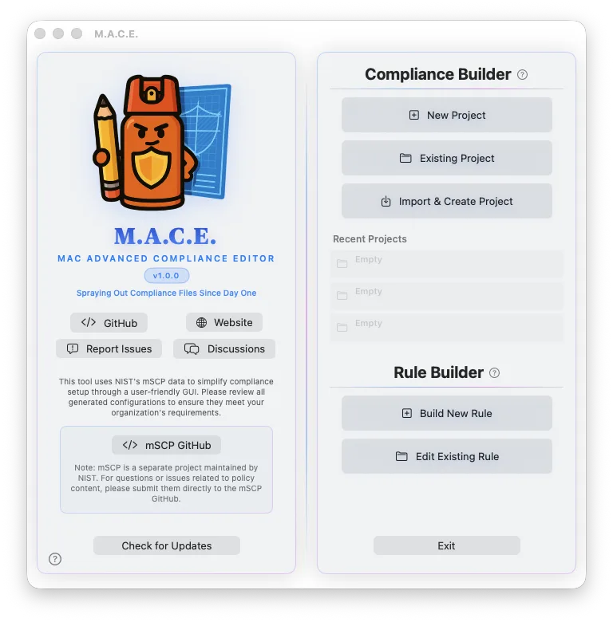
  </picture>
  
<em>Main menu & project dashboard</em>

</td>
<td align="center">
  <picture>
    <source media="(prefers-color-scheme: dark)" srcset=".github/images/compliance-editor-dark.webp">
    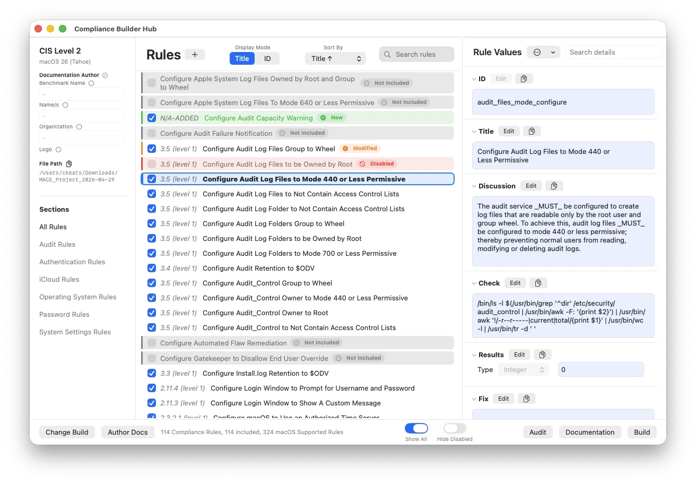
  </picture>
  
<em>Compliance editor & rule hub</em>

</td>
</tr>
<tr>
<td align="center">
  <picture>
    <source media="(prefers-color-scheme: dark)" srcset=".github/images/build-dark.webp">
    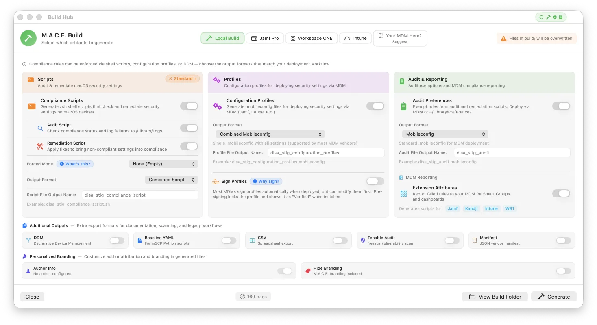
  </picture>
  
<em>Build hub & artifact generation</em>

</td>
<td align="center">
  <picture>
    <source media="(prefers-color-scheme: dark)" srcset=".github/images/audit-dark.webp">
    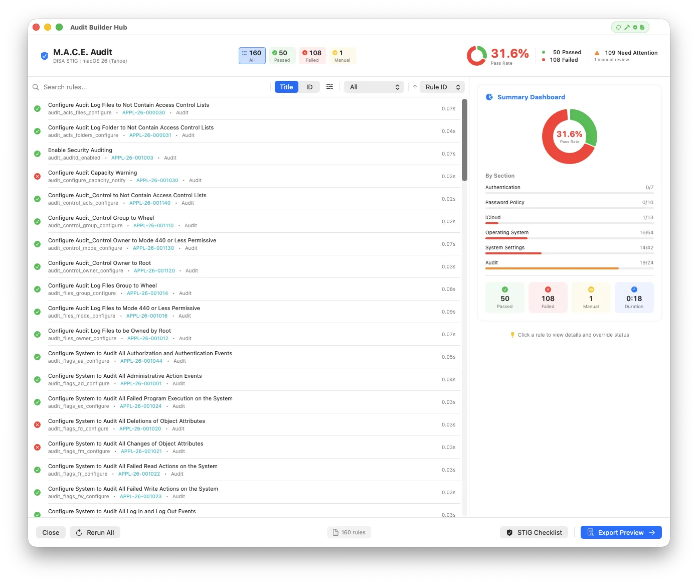
  </picture>
  
<em>Audit results & compliance dashboard</em>

</td>
</tr>
<tr>
<td align="center">
  <picture>
    <source media="(prefers-color-scheme: dark)" srcset=".github/images/documentation-dark.webp">
    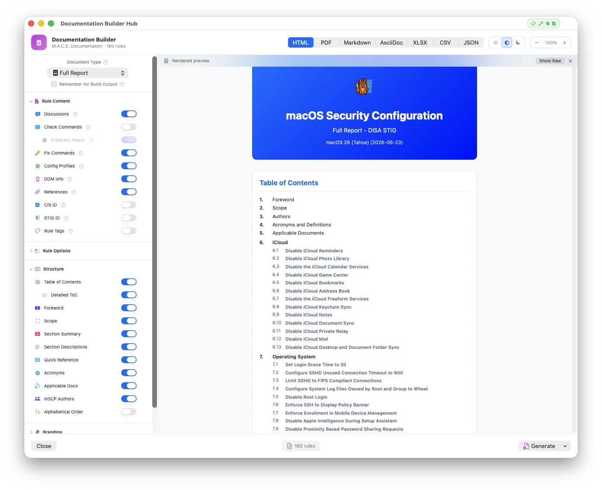
  </picture>
  
<em>Documentation generation options</em>

</td>
<td align="center">
  <picture>
    <source media="(prefers-color-scheme: dark)" srcset=".github/images/rule-builder-dark.webp">
    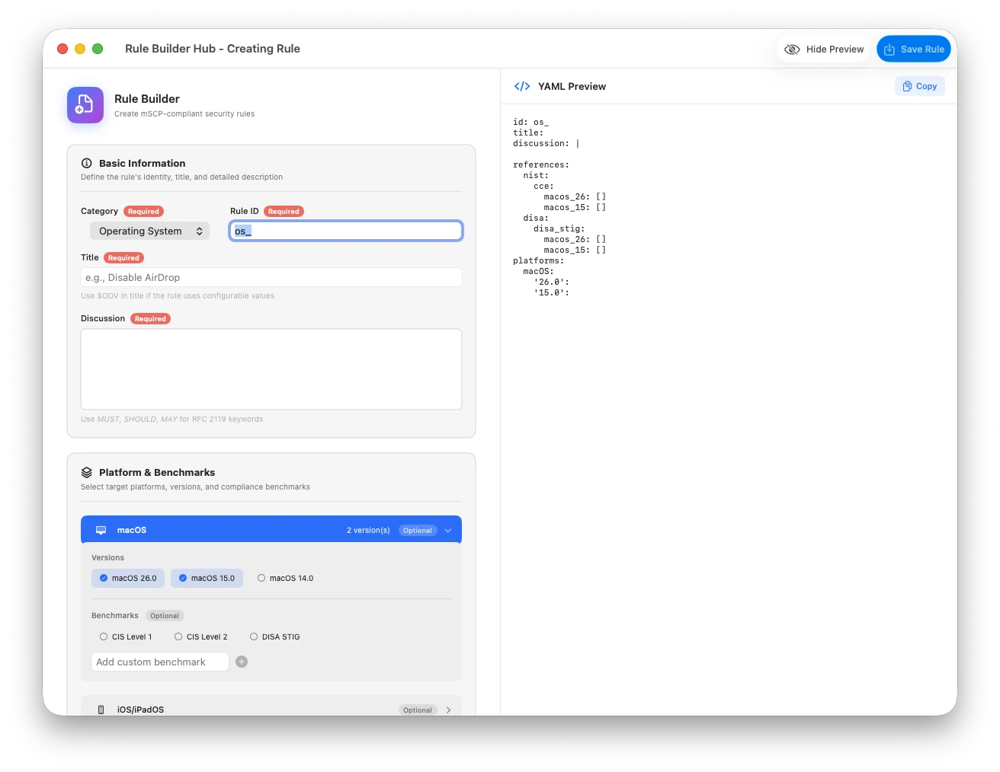
  </picture>
  
<em>Rule builder with YAML preview</em>

</td>
</tr>
</table>

### Audit Output Examples
Click any preview below to download the sample file and open it locally. GitHub limits in-browser viewing of HTML and CSV files, so downloading is the best way to see the full output.

<table>
<tr>
<td align="center">
  <a href="audit_examples/Audit_Report_Example.pdf">
    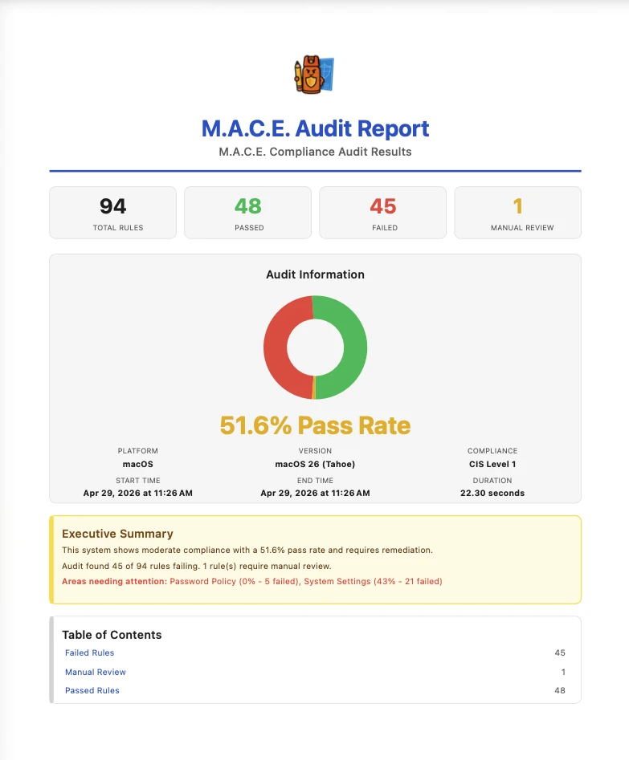
  </a>
  
<em>PDF report</em>

</td>
<td align="center">
  <a href="audit_examples/Audit_Report_Example.html">
    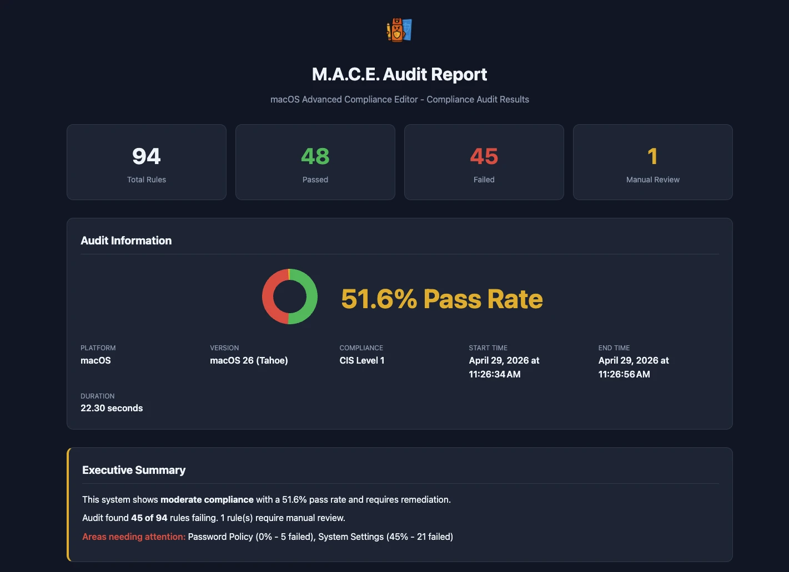
  </a>
  
<em>HTML report</em>

</td>
<td align="center">
  <a href="audit_examples/Audit_Report_Example.csv">
    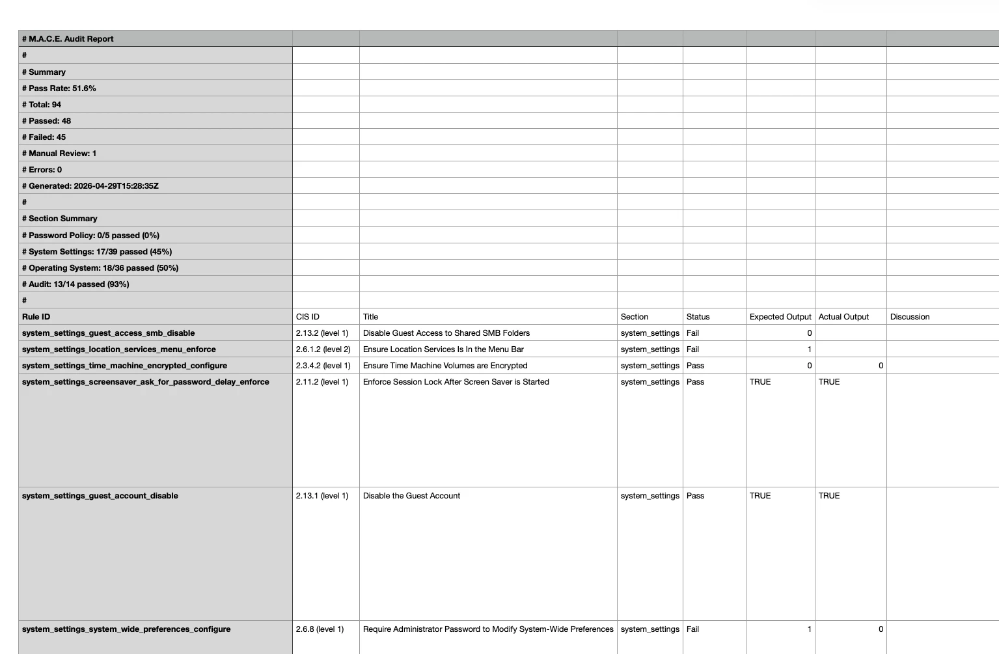
  </a>
  
<em>CSV report</em>

</td>
</tr>
</table>

## Features

### Project Management

  <picture>
    <source media="(prefers-color-scheme: dark)" srcset=".github/images/new-project-dark.webp">
    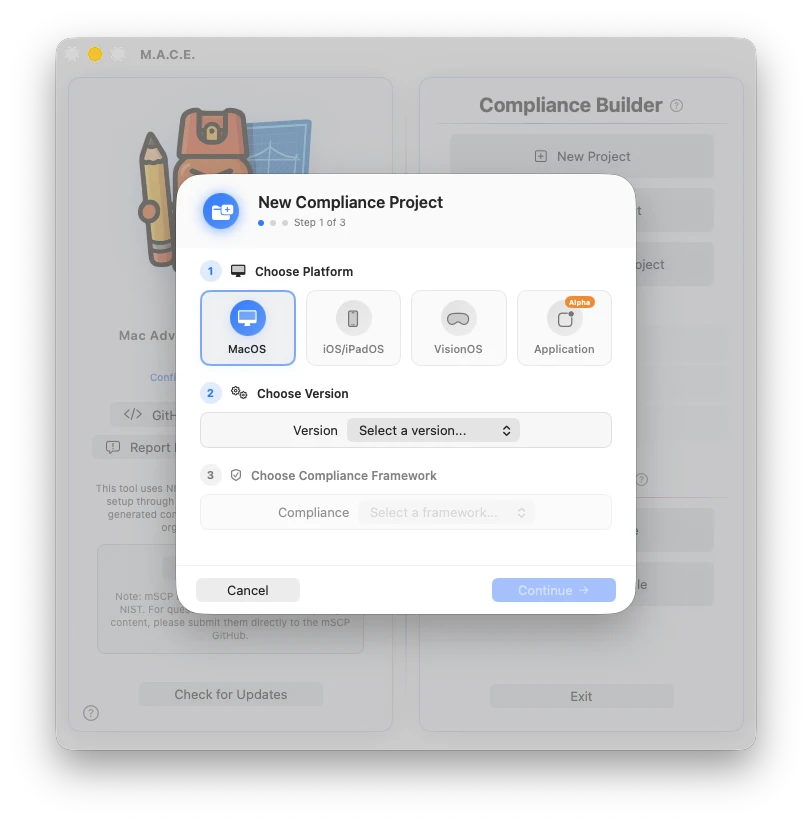
  </picture>

<em>New project wizard — select platform, version, and compliance framework</em>

- Create compliance projects for macOS, iOS/iPadOS, and visionOS
- Application platform *(in testing)* — build baselines for Chrome, Edge, and Firefox
- Open and manage existing projects (`.mace` file format)
- Import Jamf Compliance Editor (`.jce`) files with auto-detected platform, version, and framework
- Import mSCP 1.0 baselines
- Duplicate existing projects
- Recent projects list for quick access
- Platform and compliance framework selection wizard
- Automatic project saving with unsaved changes detection

### Compliance Editor
- **Three-panel interface:** Sections sidebar, searchable rule list, and detailed editor
- Browse 500+ security rules organized by section
- Search, filter, and sort by:
  - Compliance framework (STIG, CIS, NIST, etc.)
  - Section/category
  - Tags and metadata
  - Modification status (modified vs. baseline)
  - Enabled/disabled status
- Sort modes: Title, Rule ID, Section, Included status, Modified status, or STIG/CIS ID (ascending/descending)
- "Show All" mode to view all available rules regardless of framework
- Hide disabled rules toggle
- Search within rule details across all fields
- Keyboard shortcuts for power users (Space bar to toggle rules)

### Rule Editing
- Edit all rule fields:
  - Discussion, check criteria, and remediation instructions
  - References and citations (NIST, DISA, CIS)
  - Tags and metadata
  - Mobile configuration payloads
  - DDM (Declarative Device Management) declarations
  - Organizational Defined Values (ODVs) with type hints, validation, and constraints
  - Shell scripts for fixes
  - Platform compatibility
- Disable/enable rules with custom justification text
- Include/exclude rules from baselines
- Flag rules for review with comments
- Track customizations with visual modification indicators and color-coded status
- Side-by-side comparison: baseline vs. custom rule versions
- Automatic YAML structure preservation

### Rule Builder
- Create custom security rules from templates
- Edit standalone rule YAML files
- Full validation of rule ID and structure
- Section/category assignment, tags, references, mobileconfig, DDM, and ODV support

### Rule Updates

  <picture>
    <source media="(prefers-color-scheme: dark)" srcset=".github/images/update-dark.webp">
    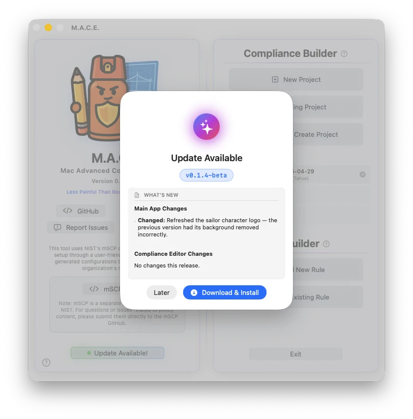
  </picture>

<em>Rule update detection with change summary</em>

- Check for rule updates from the mSCP repository
- Detect updated, new, and removed rules with detailed change reports
- Auto-download latest rules from GitHub on app launch (configurable)
- Batch update management with framework filtering

### Settings & Appearance

  <picture>
    <source media="(prefers-color-scheme: dark)" srcset=".github/images/settings-dark.webp">
    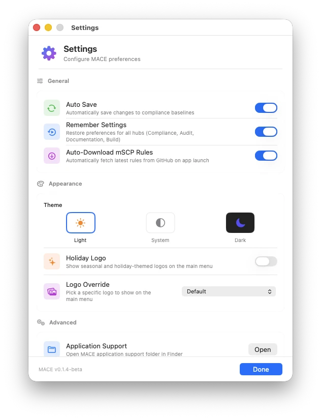
  </picture>

<em>Settings — general, appearance, and advanced options</em>

- Light, Dark, and System theme support
- 13+ seasonal and holiday app icons (automatically switch by date)
- Auto-save functionality
- Display settings memory (remember preferences across all hubs)
- Release channel selection: Alpha, Beta, Stable
- Application logging console with real-time logs, export, and log levels
- Advanced options: clear cache, reset Python/Ruby environments, open data folder

## Build Capabilities

### Script Generation
| Output | Description |
|--------|-------------|
| Audit Scripts | Shell scripts for compliance checking |
| Remediation Scripts | Shell scripts to fix non-compliant settings |
| Extension Attributes | Scripts for Jamf Pro and other MDMs |

### Configuration Profiles
| Format | Use Case |
|--------|----------|
| `.mobileconfig` | Apple Configuration Profiles (combined or individual) |
| Plist | Jamf Pro Custom Settings |
| XML | Microsoft Intune |
| Signed Profiles | Digital signature support with certificate verification |

### Declarative Device Management (DDM)
- Generate DDM declarations and artifacts
- Support for Apple's modern management APIs
- Service path configuration for system services

### Artifact Formats
| Format | Description |
|--------|-------------|
| Shell Scripts | Combined or individual audit/remediation scripts |
| `.mobileconfig` | Combined or individual Apple Configuration Profiles |
| DDM JSON | Declarative Device Management declarations |
| Plist / XML | Jamf Pro and Intune configuration formats |
| Excel / CSV | Spreadsheet export for analysis |
| Audit Plist | Audit preference files for system scanning |
| Baseline YAML | Updated baseline file |
| README | Auto-generated build information |

### Build Engines
- **M.A.C.E. Build Engine:** Native Swift engine with full customization and advanced output options
- **mSCP Build Engine:** Official NIST Python scripts with real-time output monitoring and progress tracking

### Build Targets
| Target | Description |
|--------|-------------|
| **Local** | Generate files for local deployment |
| **Jamf Pro** | Upload profiles, scripts, and extension attributes directly (Basic Auth & OAuth) |
| **Workspace ONE** | Upload profiles, scripts, and sensors directly (Basic Auth, OAuth2 & Token) |
| **Microsoft Intune** | Upload profiles, scripts, and custom attributes directly (Tenant/Client auth) |
| **Kandji** | Profile and script export *(coming soon)* |
| **Mosyle** | Configuration push *(coming soon)* |

### Build Options
- Configurable output options per artifact type
- Author metadata, organization name, and baseline versioning
- Custom output directory selection
- Profile signing with certificate verification
- Jamf Pro category creation and assignment
- Workspace ONE organization group selection and region configuration
- Intune tenant and client credential configuration

## Documentation Hub

### Documentation Types
| Type | Description |
|------|-------------|
| **Compliance Guide** | Full documentation with discussions, check procedures, and remediation steps |
| **Technical Reference** | Technical details, scripts, commands, and configuration examples |
| **Executive Summary** | High-level overview suitable for management with key metrics |

### Documentation Formats
| Format | Description |
|--------|-------------|
| PDF | Styled documents with headers, footers, table of contents, and page breaks |
| HTML | Interactive web-ready reports with navigation and syntax highlighting |
| Excel | Workbooks with multiple sheets, formatted tables, and summary statistics |

### Documentation Options
- Configurable content: discussions, check procedures, remediation, references, platform info
- Author, organization, benchmark name, and timestamp metadata
- Both MACE and mSCP documentation engines available

## Audit & Verification

### Audit Engines
- **M.A.C.E. Audit Engine:** Native Swift engine with advanced filtering and detailed result analysis
- **mSCP Audit Engine:** Official NIST Python scripts with real-time output monitoring

### Compliance Auditing
- Run automated compliance checks against your baseline
- Real-time progress tracking with live watch capability
- Status tracking: Pass, Fail, Error, Manual Review, Not Applicable
- Section-by-section compliance analysis
- User comments and notes on individual results
- Manual override capability for audit results
- Device metadata display (hostname, model, serial number, OS version)
- Privileged helper for system-level compliance checks

### Audit Results
- Comprehensive summary dashboard with pass/fail counts and percentages
- Detailed rule-by-rule results with expected vs. actual output
- Color-coded status indicators
- Execution time per rule

### Export Formats

| Format | Description |
|--------|-------------|
| **DISA STIG CKL** | Compatible with STIG Viewer; automatic STIG ID mapping |
| **CSV** | Spreadsheet-friendly with summary statistics and device info |
| **HTML** | Interactive web-viewable reports with charts and navigation |
| **PDF** | Professional documents with headers, summaries, and details |
| **Excel (XLSX)** | Formatted workbook with color coding and summary sheet |

## Import & Integration

### Import Formats
| Format | Description |
|--------|-------------|
| **Jamf Compliance Editor (`.jce`)** | Import JCE files with auto-detected platform, version, compliance framework, and rule exclusions |
| **mSCP 1.0 Baselines** | Import existing mSCP 1.0 baselines into M.A.C.E. projects |

### Jamf Pro Integration
- Upload configuration profiles, remediation scripts, and extension attributes directly to Jamf Pro
- Authentication via Basic Auth or OAuth
- Category creation and assignment
- Connection testing and duplicate handling
- Upload progress tracking

### Workspace ONE Integration
- Upload configuration profiles, scripts, and sensors directly to Workspace ONE
- Authentication via Basic Auth, OAuth2, or Token-based
- Region selection (North America, Europe, Asia-Pacific, China)
- Organization group discovery and selection
- Connection testing and upload progress tracking

### Microsoft Intune Integration
- Upload configuration profiles, scripts, and custom attributes directly to Intune
- Authentication via Tenant ID, Client ID, and Client Secret
- Connection testing and upload progress tracking

### Automatic App Updates

  <picture>
    <source media="(prefers-color-scheme: dark)" srcset=".github/images/project-update-dark.webp">
    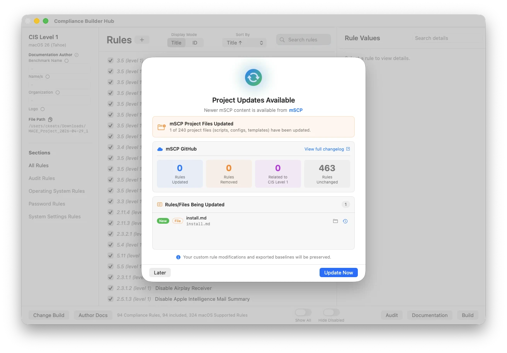
  </picture>

<em>In-app update dialog with changelog</em>

- Background update checking with release channel selection (Alpha, Beta, Stable)
- Download progress tracking with signature verification
- Privileged helper for seamless installation

## Status

> **Beta Release**
> This is a beta release. Core features are stable and ready for real-world use, but some features are still being refined based on community feedback.

**Current Focus:**
- Expanding MDM platform integrations (Kandji, Mosyle)
- Improving audit export accuracy for MDM platforms

**Known Limitations:**
- Rules may not reflect the latest guidance until mSCP 2.0 is finalized
- Some export formats may have issues with specific MDM platforms (Intune, Jamf)
- Currently supports American English only

**Feedback:**
- Bug reports are welcome via [GitHub Issues](https://github.com/MACE-App/MACE/issues)
- Feature suggestions and "nice to have" ideas help guide development

**Website:** Visit [getmace.com](https://getmace.com) for tutorials, usage guides, and the latest news.

## Upcoming Features

### Import Enhancements
- Convert external configurations to projects

### Audit Enhancements
- Apply fixes directly from audit results
- Compare audits over time
- Track compliance history

### MDM Targets
- Kandji direct integration
- Mosyle direct integration

### Additional Enhancements
- Additional language support
- Visual and functional improvements across all features

## Community & Feedback

M.A.C.E. is a **community-driven project**. I personally work with STIGs, so many features were built around that workflow but I want this app to work for everyone. Whether you're using CIS, NIST 800-53, CMMC, or something else entirely, your input matters.

**I'd love to hear from you:**
- What compliance frameworks do you use?
- What features would make your workflow easier?
- What's missing or could be improved?

**Join the conversation on Slack:** Chat with other MACE users, share tips, and get help in the [`#mace-app`](https://macadmins.org) channel on the [Mac Admins Slack](https://macadmins.org).

Open an [issue](https://github.com/MACE-App/MACE/issues), start a [discussion](https://github.com/MACE-App/MACE/discussions), or visit [getmace.com](https://getmace.com) — your feedback directly shapes development.

## Credits

Powered by [NIST mSCP 2.0](https://pages.nist.gov/macos_security/).
Created by a Mac admin for the macOS admin community.

  <a href="https://getmace.com">Website</a> •
  <a href="https://github.com/MACE-App/MACE/releases">Download Latest Release</a> •
  <a href="https://github.com/MACE-App/MACE/issues">Report an Issue</a> •
  <a href="https://github.com/MACE-App/MACE/discussions">Discussions</a> •
  <a href="https://macadmins.org">#mace-app on Mac Admins Slack</a>

