<p align="center">
  
</p>

<h1 align="center">M.A.C.E. (macOS Advanced Compliance Editor)</h1>
<p align="center"><strong>Build, customize, audit, and deploy macOS security baselines. No command line required.</strong></p>

<p align="center">
  <a href="https://getmace.com">
    
  </a>
  
  
  <a href="https://github.com/MACE-App/MACE/releases">
    
  </a>
  <a href="https://github.com/MACE-App/MACE/releases">
    
  </a>
  <a href="https://github.com/MACE-App/MACE/blob/main/LICENSE">
    
  </a>
</p>
<p align="center">Join us in <a href="https://macadmins.org/community/slack/"><strong>#mace-app</strong></a> on Mac Admins Slack</p>

<div align="center">

<table>
  <tr>
    <th>🌟 Explore the M.A.C.E. Website 🌟</th>
    <th>⭐ Support the Project: Give it a Star! ⭐</th>
  </tr>
  <tr>
    <td align="center">🌐 <strong>Visit:</strong> <a href="https://getmace.com">getmace.com</a> 🌐<br />Guides, docs, and screenshots for every feature</td>
    <td align="center">
      <a href="https://github.com/MACE-App/MACE">
        
      </a>
      <br />Stars help other Mac admins find M.A.C.E.
    </td>
  </tr>
</table>

</div>

## Contents
- [About](#about)
- [Why MACE?](#why-mace)
- [Installation](#installation)
- [Quick Start](#quick-start)
- [Features](#features)
  - [Build Targets](#build-targets)
  - [Output Examples](#output-examples)
  - [Staying Current](#staying-current)
- [Status](#status)
- [Community & Feedback](#community--feedback)
- [Share the Project](#share-the-project)
- [About the Developer](#about-the-developer)
- [Credits](#credits)

## About

**M.A.C.E. (macOS Advanced Compliance Editor)** is a GUI for the [macOS Security Compliance Project (mSCP)](https://github.com/usnistgov/macos_security), the open source project hosted by NIST. MACE reads the mSCP rule library and uses it to generate the frameworks, baselines, profiles, and scripts that bring your devices into compliance.

Built in Swift and SwiftUI, it's a native macOS app that lets you create, customize, audit, and export compliance configurations **without touching the command line**.

### Built by a Mac Admin, for Mac Admins

MACE started from a simple frustration. As a Mac admin using mSCP day-to-day, the project was incredible, but the workflow wasn't. Bouncing between terminal windows, editing YAML files by hand, and running Python scripts just to see what changed got old fast.

I wanted something I could actually *see*. Browse the rules, change a setting without looking up the syntax, hit build. Something I could hand to a newer admin without walking them through Git first. **So I built my own, with the Mac admin in mind the whole way through.**

There's no company behind this. I'm a Mac admin building a tool for other Mac admins, trying to do my job with something that actually works for me.

**Who it's for.** Three groups kept coming up:

- **The ones who don't code.** They have a mandate, a fleet, and a deadline. What they don't have is the Python, Ruby, Git, and terminal background the project assumes.
- **The ones who need more than the current tools give them.** They know exactly what they want out of their build, and the existing apps stop short of it.
- **The ones already running mSCP who want it simpler.** No trouble with it at all. They just want to get there faster, without the setup and the scripts every time.

### MACE and mSCP

The [macOS Security Compliance Project](https://github.com/usnistgov/macos_security) is the gold standard for Apple security baselines, a collaboration between NIST, NASA, DISA, and LANL, documented by Apple in their own [platform certifications guide](https://support.apple.com/guide/certifications/macos-security-compliance-project-apc322685bb2/web).

Every rule, framework, and piece of compliance logic in MACE comes straight from mSCP. **The expertise stays with the experts.** MACE is the front end: it takes what mSCP already does well and puts a real interface on it, so an admin can get to a working baseline without learning a toolchain first.

That split is the point. mSCP keeps doing what it does best: more rules, more frameworks, more baselines. MACE brings more people to it.

> **The full introduction lives on the website** at **[getmace.com/docs/intro](https://getmace.com/docs/intro)**, including how the two build engines differ and why MACE exists alongside Jamf Compliance Editor and WOMBAT.

## Why MACE?

| | |
|---|---|
| **No command line required** | Visual interface for creating and managing compliance baselines |
| **Native macOS app** | Built with SwiftUI for a fast, responsive experience |
| **Dual build engines** | Native MACE engine and official mSCP Python scripts |
| **All-in-one workflow** | Create, customize, audit, document, and export from a single app |
| **MDM-ready exports** | Generate deployment-ready profiles for Jamf, Workspace ONE, Intune, Iru, Fleet, Addigy, and more |
| **Direct MDM upload** | Upload profiles, scripts, and extension attributes straight to Jamf Pro, Workspace ONE, Intune, Fleet, Iru, or Addigy |
| **Free to use** | Community-driven development with no licensing fees (source code is not public, see [Status](#status)) |

## Installation

**Requires macOS 14 (Sonoma) or later.** All three methods install the same signed build.

**Direct download**

Grab the latest `.dmg` from the [Releases page](https://github.com/MACE-App/MACE/releases) and drag M.A.C.E. to your Applications folder. The app updates itself from here on out (see [Staying Current](#staying-current)).

**Homebrew**

```sh
brew install --cask mace
```

**Installomator**

For MDM-driven deployment, use the `mace` label. Installomator must run as root:

```sh
sudo ./Installomator.sh mace
```

It pulls the latest release straight from this repo and verifies the Developer ID Team ID `7U624389H9`.

## Quick Start

1. **Install** M.A.C.E. using any of the methods above
2. **Create** a new project and select your compliance framework
3. **Customize** rules to fit your organization's needs
4. **Build** scripts and configuration profiles for deployment
5. **Audit** your Mac and export compliance reports

> **Full instructions live on the website.** Step-by-step tutorials, usage guides, and walkthroughs for every hub are at **[getmace.com](https://getmace.com)**. Start there if you want more than the five-step version above.

## Features

<p align="center">
  <picture>
    <source media="(prefers-color-scheme: dark)" srcset=".github/images/main-menu-dark.webp">
    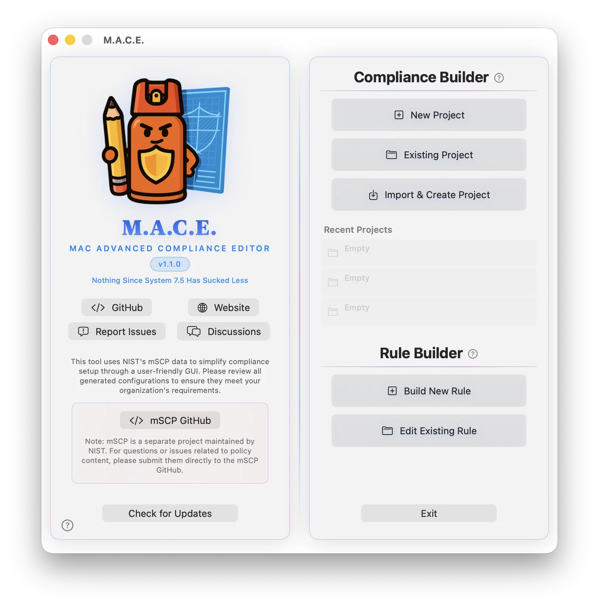
  </picture>
</p>
<p align="center"><em>Main menu & project dashboard</em></p>

| Area | What it does | Docs |
|---|---|---|
| **Project Management** | Projects for macOS, iOS/iPadOS, and visionOS, plus Chrome, Edge, and Firefox baselines *(in testing)*. Opens `.mace` projects and imports Jamf Compliance Editor `.jce` files with auto-detected platform, version, and framework. | [Guide](https://getmace.com/docs/getting-started/projects) |
| **Compliance Editor** | Three-panel editor over 800+ mSCP rules: search, filter, and sort by framework, section, tags, or modification state, then edit discussions, checks, remediations, references, mobileconfig payloads, DDM declarations, and ODVs. | [Guide](https://getmace.com/docs/compliance-editor/overview) |
| **Rule Builder** | Author custom rules from templates or edit standalone YAML, with full rule ID and structure validation. | [Guide](https://getmace.com/docs/custom-rules/overview) |
| **Rule Updates** | Detects new, updated, and removed rules from the mSCP repository with a per-rule change report. Your customizations are preserved. | [Guide](https://getmace.com/docs/compliance-editor/overview) |
| **Build** | Audit and remediation scripts, `.mobileconfig` profiles (signed or unsigned), DDM declarations, and extension attributes, plus Tenable `.audit`, CSV, manifest, and baseline YAML. Native MACE engine or the official mSCP Python scripts. | [Guide](https://getmace.com/docs/build/overview) |
| **Documentation** | Full baseline documents in PDF, HTML, Markdown, AsciiDoc, Excel, CSV, or JSON, with a live preview that updates as you change options. | [Guide](https://getmace.com/docs/documentation/overview) |
| **Audit & Verification** | Run a baseline against a Mac, review pass/fail/manual results section by section, and export in seven formats plus DISA STIG CKL and CKLB. | [Guide](https://getmace.com/docs/audit/overview) |
| **Settings & Appearance** | Themes, 75+ seasonal app icons, auto-save, Git-ready projects, release channel selection, logging console, and environment resets. | [Guide](https://getmace.com/docs/reference/settings) |

### Build Targets

<p align="center">
  <picture>
    <source media="(prefers-color-scheme: dark)" srcset=".github/images/build-dark.webp">
    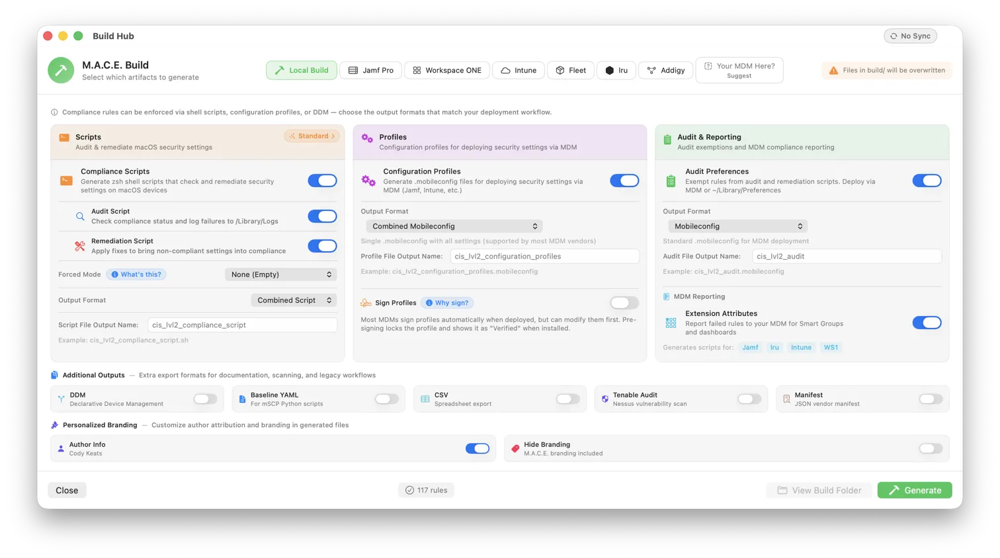
  </picture>
</p>
<p align="center"><em>Build hub: pick a target, choose which artifacts to generate, and customize output names and branding</em></p>

Build locally, or upload straight to any of six MDM platforms:

| Target | Direct upload |
|--------|---------------|
| **Jamf Pro** | Profiles, scripts, extension attributes, and audit preferences (Basic Auth & OAuth) |
| **Workspace ONE** | Custom Settings profiles, scripts, and sensors (Basic Auth, OAuth2 & Token) |
| **Microsoft Intune** | Profiles, shell scripts, and custom attributes via the Graph API (Tenant/Client auth) |
| **Fleet** | Profiles, scripts, and audit preferences, plus an osquery compliance policy (email/password or API token) |
| **Iru** | Custom Profiles, Custom Scripts, and audit preferences, with optional Blueprint assignment (API token) |
| **Addigy** | Custom MDM profiles, scripts, audit preferences, and a compliance Custom Fact, with optional policy assignment (API key) |

More MDM targets are always on the table. The Build Hub has a **Your MDM Here? Suggest** button for exactly that. Adding one isn't purely up to M.A.C.E., though: the vendor has to expose the right API options before direct upload is possible, and demand from users of that platform is what decides which ones get built first. If you'd like to see your MDM supported, suggest it in the app or [open an issue](https://github.com/MACE-App/MACE/issues). Asking your vendor for the API access it needs helps just as much.

### Output Examples

Click any preview to download the sample and open it locally. GitHub limits in-browser viewing of HTML and Excel files, so downloading is the best way to see the full output.

<p align="center">
  <picture>
    <source media="(prefers-color-scheme: dark)" srcset=".github/images/documentation-dark.webp">
    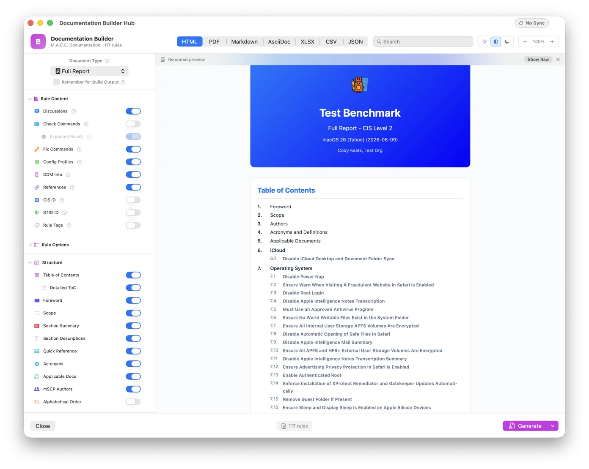
  </picture>
</p>
<p align="center"><em>Documentation builder: switch formats, toggle content, and watch the rendered preview update live</em></p>

**Documentation:** [AsciiDoc](example_outputs/Documentation_Example.adoc) · [CSV](example_outputs/Documentation_Example.csv) · [JSON](example_outputs/Documentation_Example.json)

<table>
<tr>
<td align="center">
  <a href="example_outputs/Documentation_Example.pdf">
    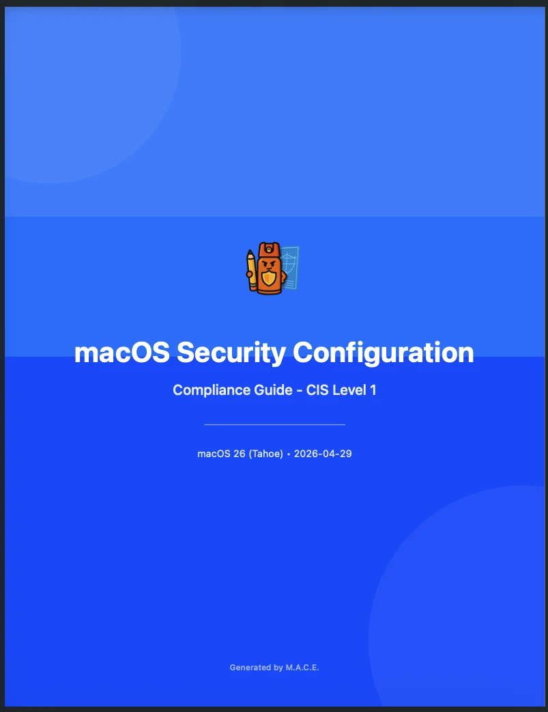
  </a>
  <p align="center"><em>PDF document</em></p>
</td>
<td align="center">
  <a href="example_outputs/Documentation_Example.html">
    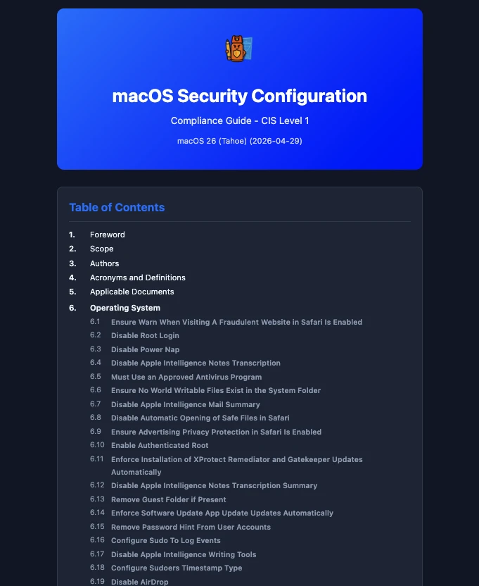
  </a>
  <p align="center"><em>HTML document</em></p>
</td>
<td align="center">
  <a href="example_outputs/Documentation_Example.xlsx">
    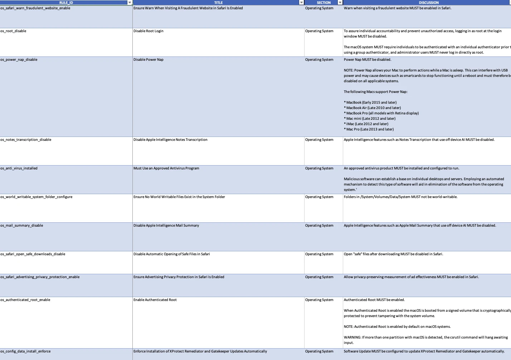
  </a>
  <p align="center"><em>Excel document</em></p>
</td>
<td align="center">
  <a href="example_outputs/Documentation_Example.md">
    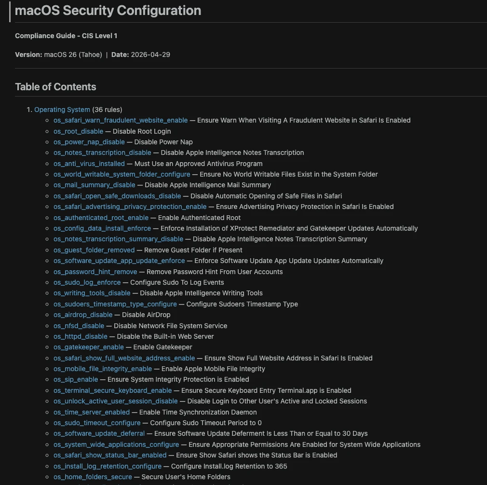
  </a>
  <p align="center"><em>Markdown document</em></p>
</td>
</tr>
</table>

<p align="center">
  <picture>
    <source media="(prefers-color-scheme: dark)" srcset=".github/images/audit-dark.webp">
    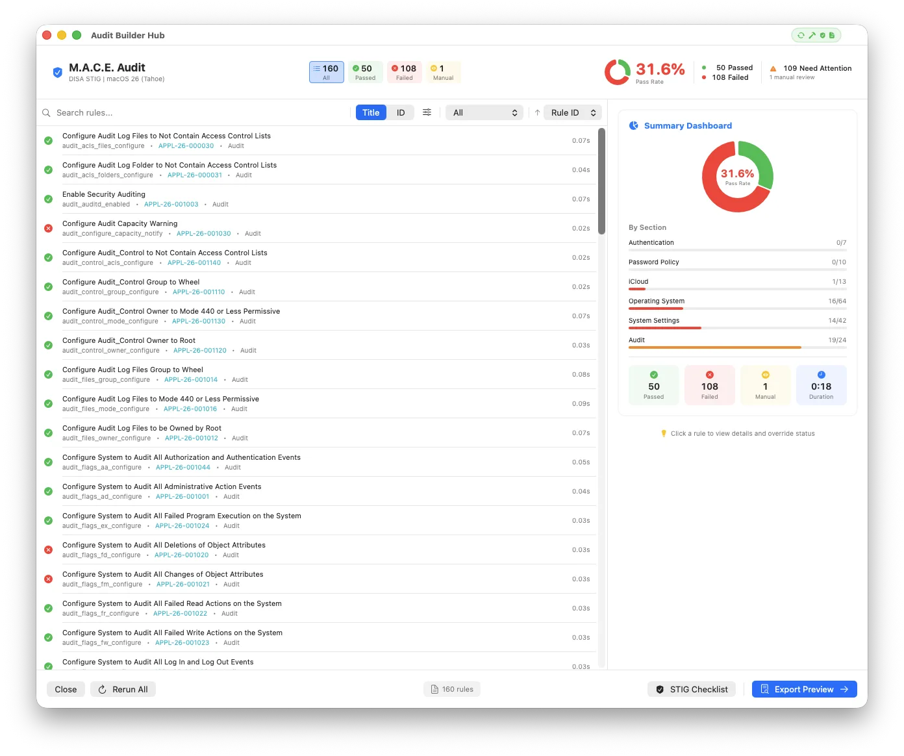
  </picture>
</p>
<p align="center"><em>Audit hub: pass rate, section-by-section breakdown, and per-rule results with DISA STIG checklist export</em></p>

**Audit reports:** [Markdown](example_outputs/Audit_Report_Example.md) · [AsciiDoc](example_outputs/Audit_Report_Example.adoc) · [JSON](example_outputs/Audit_Report_Example.json)

<table>
<tr>
<td align="center">
  <a href="example_outputs/Audit_Report_Example.pdf">
    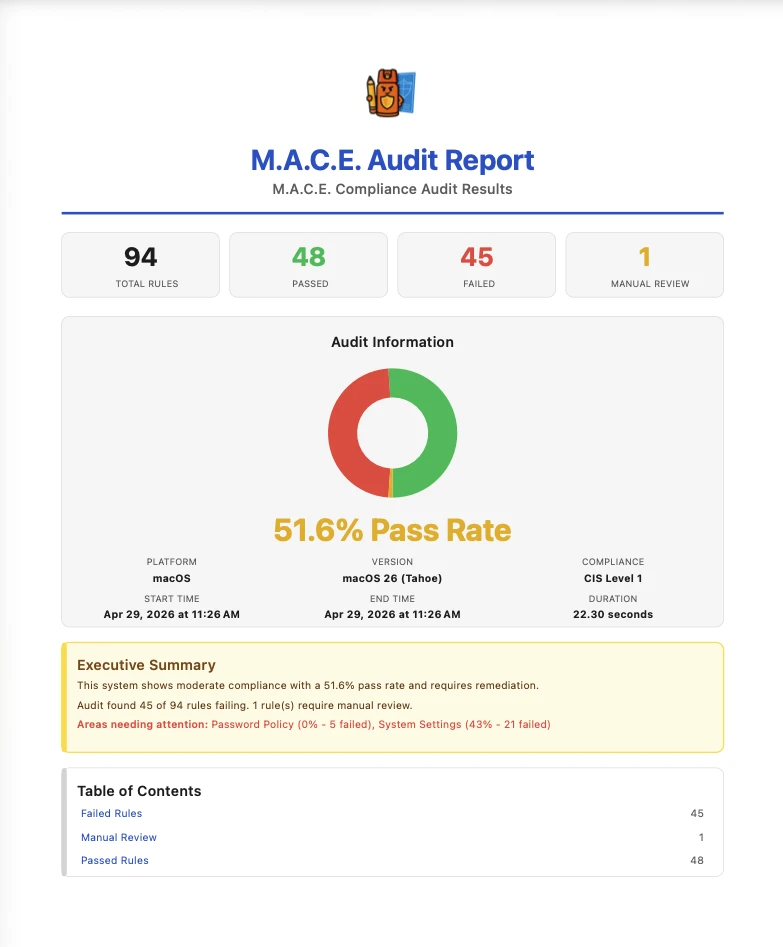
  </a>
  <p align="center"><em>PDF report</em></p>
</td>
<td align="center">
  <a href="example_outputs/Audit_Report_Example.html">
    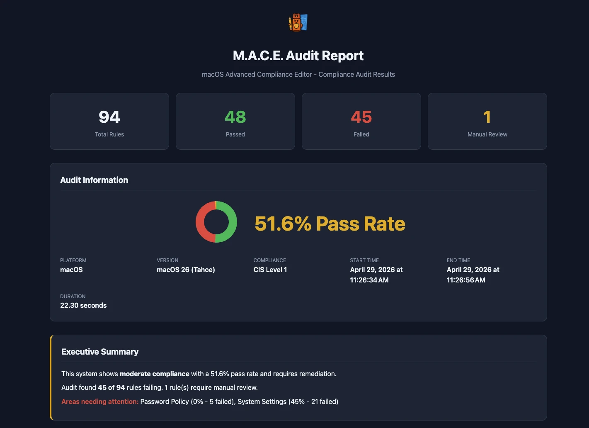
  </a>
  <p align="center"><em>HTML report</em></p>
</td>
<td align="center">
  <a href="example_outputs/Audit_Report_Example.csv">
    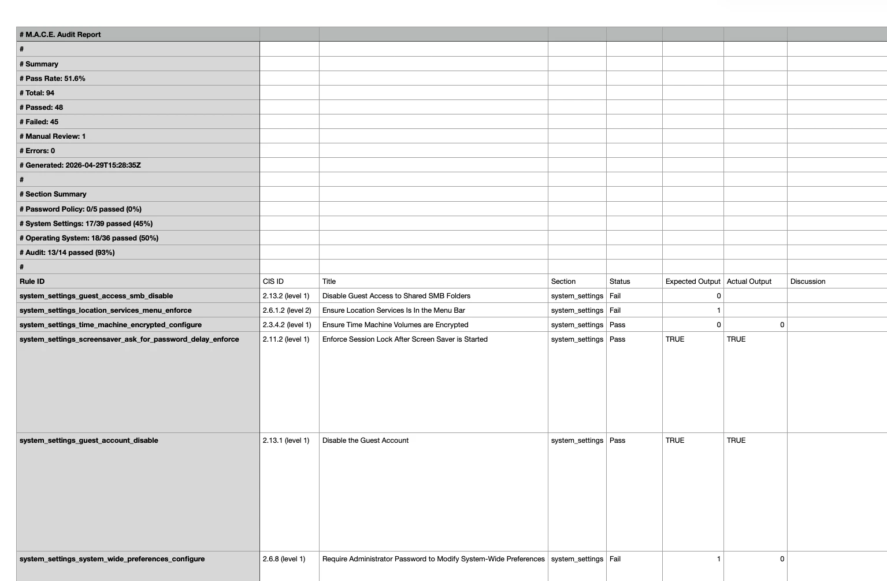
  </a>
  <p align="center"><em>CSV report</em></p>
</td>
<td align="center">
  <a href="example_outputs/Audit_Report_Example.xlsx">
    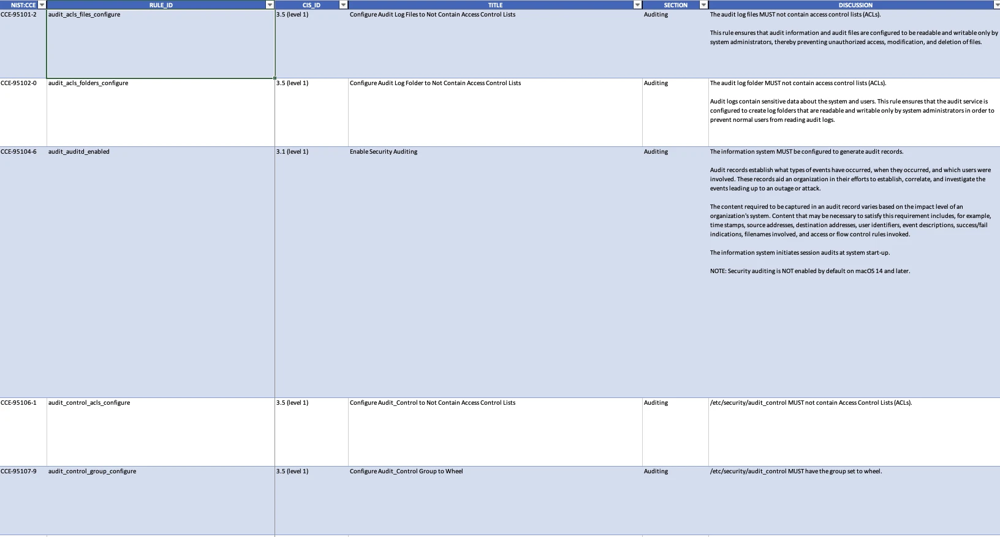
  </a>
  <p align="center"><em>Excel report</em></p>
</td>
</tr>
</table>

### Staying Current

<p align="center">
  <picture>
    <source media="(prefers-color-scheme: dark)" srcset=".github/images/project-update-dark.webp">
    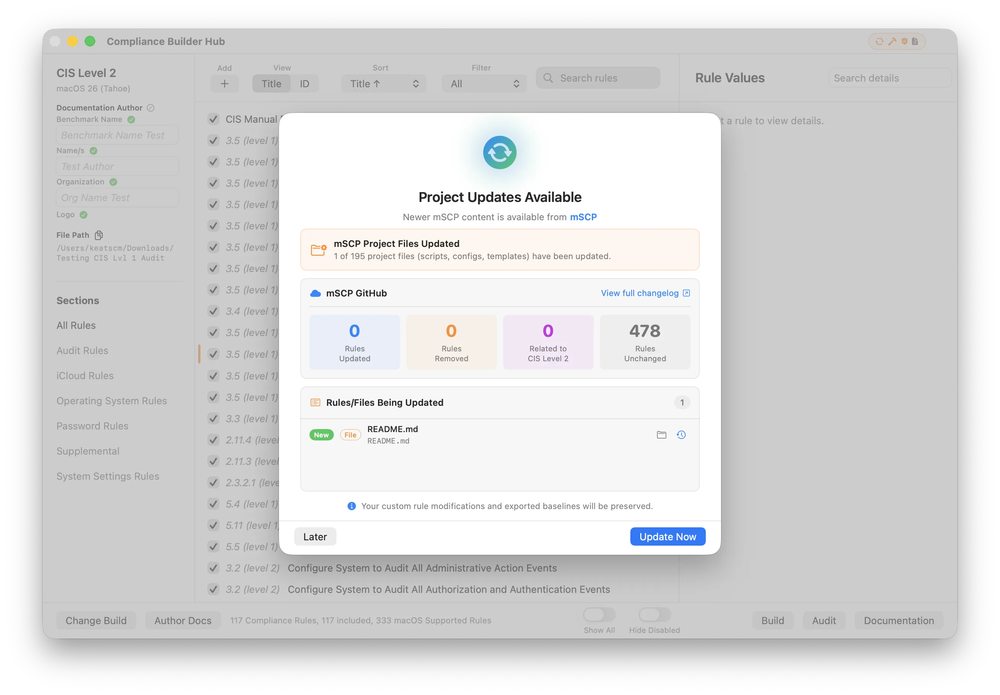
  </picture>
</p>
<p align="center"><em>Rule updates: what changed upstream, which rules it touches, and what's about to be written</em></p>

**Rules** follow mSCP. M.A.C.E. checks the project for changes and shows you exactly what moved before anything is applied: how many rules were updated or removed, how many are relevant to your framework, and a per-file list of what's about to change. Your customizations and exported baselines are preserved through the update.

**The app** updates itself in the background. Pick **Beta** or **Stable** in **Settings ▸ Updates**, and downloads are signature-verified and installed through a privileged helper.


## Status

> **Fully Released**
> M.A.C.E. is fully released and in daily use across many organizations. At this stage the thing the project needs most is **feedback**. Real-world reports on what works, what breaks, and what's missing are what drive development forward.
>
> **Two release trains:**
> - **Beta:** cutting-edge features and the newest fixes, shipped early so they can be put through real use. Choose this if you want the latest capabilities first and are willing to report back on what you find.
> - **Stable:** the settled build for production and regulated environments. Choose this if you'd rather receive changes only after they've been proven on the beta train.
>
> Both trains are fully supported. Switch between them any time in **Settings ▸ Updates**.

> **Source Code Availability**
> The full source code for M.A.C.E. is **not public**. This repository hosts releases, documentation, and issue tracking only. Development is limited to a smaller group involved with the macOS Security Compliance Project while mSCP 2.0 is still evolving. Keeping things more controlled helps avoid introducing issues while the tooling and underlying data are still changing. Security is also the priority from the start given how closely the tool interacts with compliance workflows.
>
> **Open sourcing is not planned, and that comes from user demand.** Many high compliance environments (federal, defense, and other regulated sectors) operate under policies that restrict or prohibit open source software for security-critical workflows. Those organizations make up a significant portion of M.A.C.E.'s user base and are precisely the audience the tool was built to serve. Releasing the source publicly would cut off access for the very users who need it most, so as things stand it isn't going to happen.
>
> That position follows the people using the app. If that changes, this README will change with it.

## Community & Feedback

M.A.C.E. is a **community-driven project**. Your input directly shapes what gets built next. Whether you work from STIG, CIS, NIST 800-53, CMMC, or something else entirely, the goal is for this to fit your framework rather than just one of them.

> **Note:** While community feedback drives the roadmap, the source code is not public and isn't planned to be. See [Status](#status) for context. Bug reports, feature requests, and discussion are still very welcome via the channels below.

| Where | What for |
|-------|----------|
| [Discussions](https://github.com/MACE-App/MACE/discussions) | Ask questions, share your workflow, and connect with other Mac admins |
| [Feature Ideas](https://github.com/MACE-App/MACE/discussions/categories/ideas) | Suggest and vote on features; popular requests get prioritized |
| [Issues](https://github.com/MACE-App/MACE/issues) | Found something broken? Let me know so it can be fixed |
| [`#mace-app`](https://macadmins.org/community/slack/) | The dedicated M.A.C.E. channel on Mac Admins Slack for questions, tips, and help |
| [`#macos_security_compliance`](https://macadmins.org/community/slack/) | The broader mSCP channel, for questions about the underlying framework |

Especially useful is how a build behaves in your environment, above all on the **beta** train, where new features and fixes land first. That feedback is what decides when something is ready to promote to stable.

**You don't have to write code to help.** Starring the repo, telling other Mac admins, and sharing it at meetups or with your team are how the project knows it's making a difference.

Every bug report, feature idea, and question makes M.A.C.E. better. See the [roadmap](https://getmace.com/docs/roadmap) for what's in focus now, and [getmace.com](https://getmace.com) for the latest news.

## Share the Project

<p align="center">
  
</p>

The app ships with **75+ icons that shuffle between the seasons** and the calendar. A small thing, but it keeps M.A.C.E. feeling fun and lively for the people who live in it week to week.

**Feel free to use these images whenever you talk about the project. They're here for fun.** You can download the whole set from **Settings ▸ Appearance** inside the app and use them however you like.

These are purely for fun. My goal was never to offend anyone; it was to make sure everyone felt included, at a fun level. We all come from different walks of life and work all over the world. The Mac community is a worldwide team.

**Want to see a logo that isn't here? Tell me.** I always love adding more, and the gap I'd most like to close is holidays and celebrations outside the US. If something is a big deal where you are, I probably don't know about it yet, and I'd rather hear it from you than guess. [Suggest a logo](https://github.com/MACE-App/MACE/discussions/categories/ideas) and it goes on the list.

## About the Developer


Hey, I'm **Cody Keats** ([@cocopuff2u](https://github.com/cocopuff2u)), the solo developer behind M.A.C.E. Former Navy Mac admin, mSCP contributor, and also the one behind the [MOFA project](https://github.com/cocopuff2u/mofa).

M.A.C.E. started as something I wanted for myself. The [Jamf Compliance Editor](https://trusted.jamf.com/docs/establishing-compliance-baselines#jamf-compliance-editor) deserves the credit for getting here first, and it's a great tool, but it wasn't cutting it for the way I work. I wanted to customize more. I wanted it to be simple to use. I wanted it to feel welcoming and creative instead of like a chore. So I built my own.

It's built with the Mac admin in mind, and with mSCP, which I'm a part of. The goal was an app that works hand in hand with the project rather than alongside it: when mSCP changes, M.A.C.E. can adopt it quickly instead of leaving you waiting.

I know M.A.C.E. is doing well when I see the stars go up, when it gets mentioned on some site, and when people tell me it works. Most of what's in here started as your ideas. I just put them together. Don't be a stranger!

[Website](https://codykeats.com) · [GitHub](https://github.com/cocopuff2u) · [LinkedIn](https://www.linkedin.com/in/cody-keats/) · [Contact](https://getmace.com/docs/community)

## Credits

Powered by [NIST mSCP 2.0](https://pages.nist.gov/macos_security/).
Built on the [macOS Security Compliance Project](https://github.com/usnistgov/macos_security), a collaboration between NIST, NASA, DISA, and LANL. Every rule in M.A.C.E. starts there.

<p align="center">
  <a href="https://getmace.com">Website</a> •
  <a href="https://github.com/MACE-App/MACE/releases">Download Latest Release</a> •
  <a href="https://github.com/MACE-App/MACE/issues">Report an Issue</a> •
  <a href="https://github.com/MACE-App/MACE/discussions">Discussions</a> •
  <a href="https://macadmins.org/community/slack/">#mace-app on Mac Admins Slack</a>
</p>
